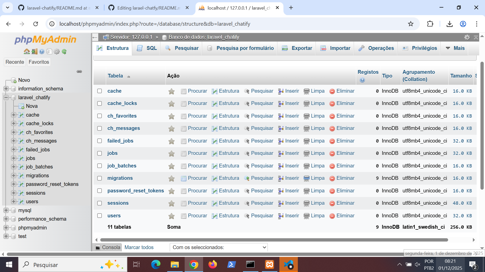
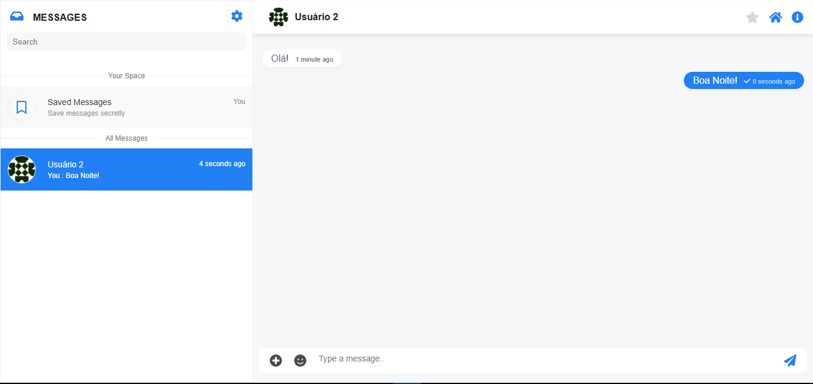

# 💬 Chat WebSocket com Laravel Breeze e Chatify

## 📘 Descrição
Projeto de chat em tempo real desenvolvido com **Laravel**, utilizando **Breeze** para autenticação e **Chatify** para mensagens via **WebSocket**.

## 🧩 Prints

### 📸 Estrutura do Banco de Dados (SGBD)

### O CHAT rodando lizin
