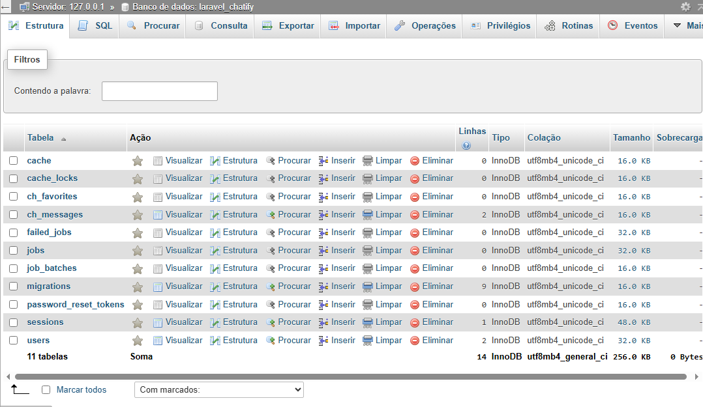
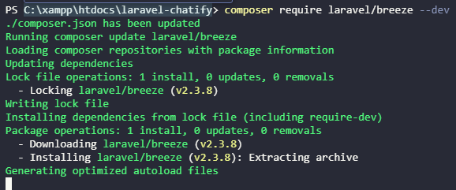
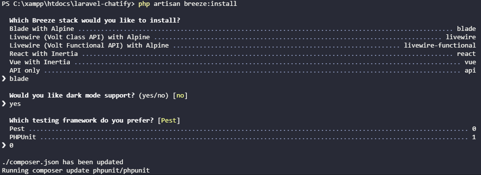

# 💬 Chat WebSocket com Laravel Breeze e Chatify

## 📘 Descrição
Projeto de chat em tempo real desenvolvido com **Laravel**, utilizando **Breeze** para autenticação e **Chatify** para mensagens via **WebSocket**.

---

## 🧩 Prints

### 📸 Estrutura do Banco de Dados (SGBD)

### ⚙️ Instalação do Laravel Breeze

### 💬 Execução do Chat (Chatify)

---

## 🔗 Repositório
[Link do projeto no GitHub](https://github.com/ferreiraluizga/laravel-chatify)